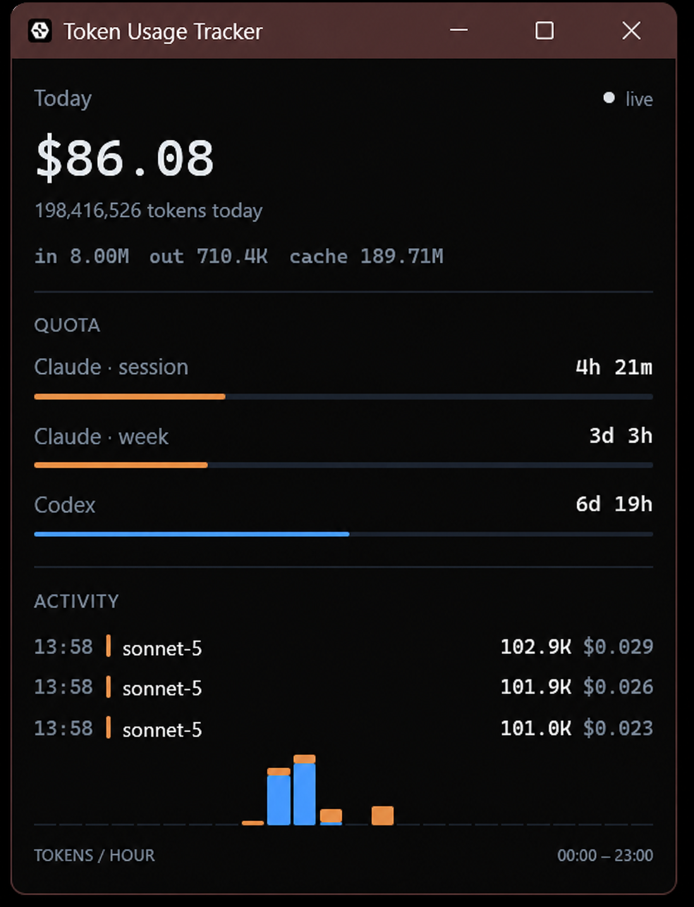

# Token Usage Tracker

[](https://github.com/hdtinh57/token-usage-tracker/actions/workflows/ci.yml)
[](https://github.com/hdtinh57/token-usage-tracker/releases/latest)
[](LICENSE)

A lightweight, realtime desktop widget for Windows that tracks [Claude Code](https://claude.com/claude-code) and [Codex CLI](https://github.com/openai/codex) token usage on your machine — cost, token counts, and quota windows — by reading local session log files directly.

No API keys, no database, no background service, no telemetry. Everything is computed locally from files already on disk.



## Features

- **Live cost & token totals** for the current local day (input / output / cache, estimated USD cost)
- **Claude quota bars** — real 5-hour and 7-day usage windows pulled from your Claude account, with time-to-reset
- **Codex quota** tracked from its own session logs
- **Per-request activity feed**, newest first
- **24-hour usage chart**, Claude and Codex stacked per hour
- **Editable, hot-reloaded pricing** at `%LOCALAPPDATA%\TokenTracker\pricing.json` (with `%APPDATA%` fallback)
- Reads existing `.jsonl` session logs only — it never changes those logs. The only network request is Claude quota polling (below).

## Installation

### Download (recommended)

Grab `token-tracker.exe` from the [latest release](https://github.com/hdtinh57/token-usage-tracker/releases/latest) and run it.

### Build from source

Requires the [Rust toolchain](https://rustup.rs/) (stable).

```
git clone https://github.com/hdtinh57/token-usage-tracker.git
cd token-usage-tracker
cargo run --release
```

## Usage

On first launch, the app creates `%LOCALAPPDATA%\TokenTracker\pricing.json` (or `%APPDATA%\TokenTracker\pricing.json` if needed) with default per-model prices in USD per 1,000,000 tokens. Edit it any time — the app reloads it during its recovery pass, at most every 10 minutes. Model names resolve by longest-prefix match, so routine version bumps (e.g. `claude-sonnet-4-6` → `claude-sonnet-4-7`) keep pricing correct without an edit.

The same folder holds `settings.json`, `history.json`, and `alerts.json`. History retains completed local days and is used by the Week and History views.

The window is a fixed 360×450, top to bottom:

- **Hero figure** — today's estimated cost, total tokens, and an in/out/cache breakdown, with a live/idle pulse indicator
- **Quota** — Claude's session (5h) and weekly (7d) windows plus Codex's window, each with time-to-reset and a fill bar
- **Activity** — a scrolling feed of individual requests
- **Tokens / hour** — a 24-bar chart of today's usage by local hour

All figures are scoped to **the current local calendar day** and reset at local midnight.

Closing the window hides it in the system tray by default; use the tray's **Quit** item to exit. The tray can also disable close-to-tray behavior, open `pricing.json`, and enable or disable quota notifications. Notifications fire once per quota reset window at 80%, 90%, 95%, and 100%.

## How it works

A background thread polls two local log roots:

- `%USERPROFILE%\.claude\projects\**\*.jsonl` (Claude Code)
- `%USERPROFILE%\.codex\sessions\**\*.jsonl` (Codex CLI)

using filesystem notifications with a 250 ms debounce, while also tailing recently-active files every second. A 10-minute recovery pass rescans active files, re-registers the watched roots, reloads pricing, and refreshes Claude quota, so missed watcher events recover without restarting. The worker publishes a coalesced in-memory snapshot the UI reads once a second.

### Claude quota polling

Claude's transcripts carry no rate-limit data, so `src/quota.rs` polls the sole network endpoint, `https://api.anthropic.com/api/oauth/usage`, authenticated with the OAuth token Claude Code already stores at `%USERPROFILE%\.claude\.credentials.json`. It is a read-only request every 3 minutes; a failed poll (offline, logged out) keeps the last good reading instead of blanking the display. Codex quota is read from its local rollout logs.

## Development

```
cargo test               # 74 unit tests: parsing, aggregation, tailing, discovery, quota
cargo clippy --all-targets -- -D warnings
cargo build --release
```

Project layout:

| File | Responsibility |
|---|---|
| `src/model.rs` | `UsageEvent`, `Totals`, `Stats` — day-scoped aggregation, rollover, repricing, filtered views |
| `src/paths.rs` | App-data paths and first-launch `pricing.json` creation |
| `src/pricing.rs` | Pricing table and longest-prefix model matching |
| `src/history.rs` | Completed-day usage history persisted as `history.json` |
| `src/parse_claude.rs` | Claude Code jsonl line parser |
| `src/parse_codex.rs` | Codex CLI jsonl parser (stateful: model from `turn_context`, tokens from `token_count`) |
| `src/quota.rs` | Polls the account's real Claude 5h/7d quota windows over the Claude Code OAuth token |
| `src/tail.rs` | Partial-line buffering + file offset tracking (truncation-safe) |
| `src/discovery.rs` | Recursive log discovery, mtime-based active-file selection |
| `src/worker.rs` | Background polling loop wiring the above together |
| `src/watch.rs` | Debounced filesystem notification paths |
| `src/tray.rs` | System-tray menu and settings controls |
| `src/ui.rs` | `egui` UI and close-to-tray behavior |

No database and no `walkdir` — directory recursion is hand-written to keep the dependency footprint small (see `Cargo.toml`: `chrono`, `eframe`, `notify`, `serde`, `serde_json`, `tray-icon`, `ureq`).

## Known limitations

- Single instance only — no cross-process lock
- A rare rename-while-writing race during log archival can drop a trailing line
- Hour-bucket alignment assumes a stable local clock (no DST / manual clock-change correction)
- Windows only

## Contributing

Issues and PRs welcome. Run `cargo test`, `cargo clippy --all-targets -- -D warnings`, and `cargo build --release` before submitting — CI runs all three on every push and PR.

## License

[MIT](LICENSE)
