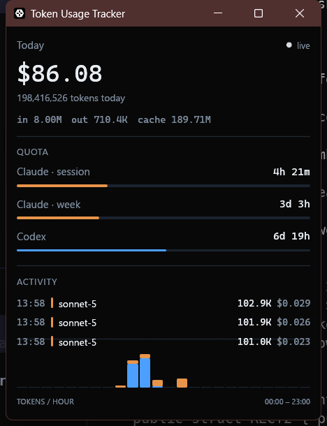

# Token Usage Tracker

Lightweight realtime desktop app (Windows) that shows [Claude Code](https://claude.com/claude-code) and [Codex CLI](https://github.com/openai/codex) token usage — input/output/cache tokens, estimated cost, and an hourly usage chart — by reading local session log files. No API keys, no database, no background service.

## How it works

A background thread polls two local log roots:

- `%USERPROFILE%\.claude\projects\**\*.jsonl` (Claude Code)
- `%USERPROFILE%\.codex\sessions\**\*.jsonl` (Codex CLI)

using a two-tier schedule — a fast tail of recently-active files (~2s) and a slower directory-discovery sweep (~20s) — and publishes a coalesced in-memory snapshot the UI reads once a second. Everything shown is scoped to **the current local calendar day** and resets at local midnight. Full design rationale (truncation handling, day-rollover semantics, repricing correctness) lives in `docs/superpowers/specs/2026-07-13-token-usage-tracker-design.md` (not tracked in git).

## Running it

```
cargo run --release
```

On first run, a `pricing.json` file is created next to the executable with default per-model prices (USD per 1,000,000 tokens). Edit it any time — prices are: hot-reloaded within ~20s. Model names are matched by longest-prefix, so routine version bumps (e.g. `claude-sonnet-4-6` → `claude-sonnet-4-7`) keep resolving to the right entry without an edit.

## UI



A fixed 360×450 window, top to bottom:

- **Hero figure** — today's estimated cost, total tokens, and an in/out/cache breakdown, with a live/idle pulse indicator.
- **Quota** — Claude session (5h) and weekly (7d) windows plus Codex's window, each with time-to-reset and a usage fill bar. Claude's numbers come straight from the account (see below); Codex's come from its own log.
- **Activity** — a fixed-row scrolling feed of individual requests, newest first.
- **Tokens / hour** — a 24-bar chart of today's usage by local hour, Claude and Codex stacked per bar.

### Claude quota polling

Claude's transcripts carry no rate-limit data, so `src/quota.rs` polls the same `api.anthropic.com/api/oauth/usage` endpoint Claude Code's own `/usage` screen reads, authenticated with the OAuth token Claude Code already stores at `%USERPROFILE%\.claude\.credentials.json`. Read-only, polled every 3 minutes, and a failed poll (offline, logged out) just keeps the last good reading instead of blanking the display.

## Development

```
cargo test      # 56 unit tests across parsing, aggregation, tailing, discovery, and quota
cargo build --release
```

Project layout:

| File | Responsibility |
|---|---|
| `src/model.rs` | `UsageEvent`, `Totals`, `Stats` — day-scoped aggregation, rollover, repricing, filtered views |
| `src/pricing.rs` | Pricing table, longest-prefix model matching, hot-reloadable `pricing.json` |
| `src/parse_claude.rs` | Claude Code jsonl line parser |
| `src/parse_codex.rs` | Codex CLI jsonl parser (stateful: model from `turn_context`, tokens from `token_count`) |
| `src/quota.rs` | Polls the account's real Claude 5h/7d quota windows over the Claude Code OAuth token |
| `src/tail.rs` | Partial-line buffering + file offset tracking (truncation-safe) |
| `src/discovery.rs` | Recursive log discovery, mtime-based active-file selection |
| `src/worker.rs` | Background polling loop wiring the above together |
| `src/ui.rs` | `egui` UI |

No database, no file-watch crate (`notify`), no `walkdir` — polling and directory recursion are hand-written per the design's dependency budget.

## Known limitations

Single instance only (no cross-process lock), a rare rename-while-writing race during log archival can drop a trailing line, and hour-bucket alignment assumes a stable local clock (no DST/manual-clock-change correction). See the spec's "Known limitations" section for details.
